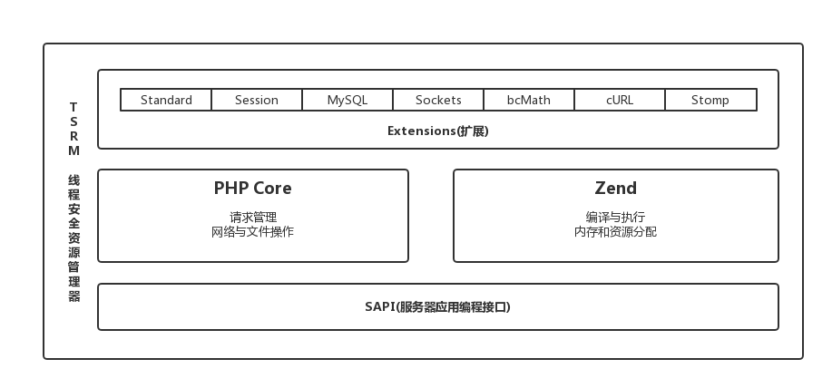

# PHP与Zend

关于PHP，你需要了解的第一件事请是它实际是由五个独立的部分组成。如下图：

在图的底部是SAPI层，它是负责协调“PHP生命周期”（0x01）与下层服务（如apache通过mod_php5.so、命令行通过cli）的接口。在后面的部分，你与在此层上操作的嵌入式SAPI进行链接。

SAPI层之上是PHP核心，它为关键事件提供绑定层，并诸如文件流、错误处理、开启关闭触发等低级操作。

在PHP核心右边是Zend引擎，它负责解析并编译编程语言到机器可识别的字节码。还在Zend虚拟机中执行该字节码，进行读写用户控件变量、管理程序流程、在函数调用期间周期性地将控制权传递给其他层。Zend还为每个请求提供内存管理和一个强大的环境操作API。

位于PHP和Zend之上的是扩展层，你可以在其中找到所有PHP语言支持的功能。这些扩展中的几个（比如standard、pcre、session）是默认编译的，通常不被认为是扩展。其他的扩展可以使用./configure命令的选项(-with-mysql或-enable-sockets)构建到PHP中；或者构建为共享模块，然后在php.ini中配置extension=或在PHP脚本中使用*dl()*函数进行加载。当你步入嵌入式和扩展开发的时候，你会接触这一层。

包裹以上所有层的就是TSRM（线程安全资源管理）层。这部分PHP解释器允许PHP的单个实例同时执行多个独立请求而不相互影响。幸运的是，这个层的大部分功能都是隐藏在宏之下的，你可以在学习本书的过程中逐渐熟悉。

[1]: http://php.net/manual/zh/function.dl.php "PHP dl()函数"