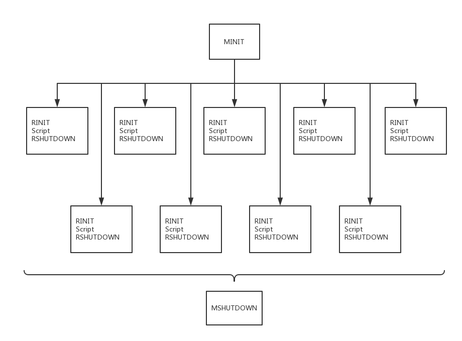

# 生命周期

每个PHP实例，无论是从初始化脚本启动还是命令行启动。都遵循MINIT、RINIT、RSHUTDOWN、MSHUTDOWN以及脚本本身的实际执行这五个部分。觉体每次启动和关闭阶段执行次数与频次取决于所使用的SAPI。最常见的四种SAPI分别是CLI/CGI、多进程模块、多线程模块和嵌入式。

## CLI生命周期

CLI（和CGI） SAPI在其每一次请求的生命周期中都是独一无二的；然而，模块和请求的步骤仍然处在独立的循环中。下图展示了在命令行执行test.php，PHP解释器所发生的一切。

## 多进程生命周期

嵌入到Web服务器中的PHP最常见的配置是使用apache 1的apxs模块（apache的扩展模块）或apache 2的预启动与多处理模块。许多其他Web服务器也属于这一类，我们称之为**多进程模型**。

因为当apache启动的时候，他会立即分出几个子进程，每个进程具有自己的进程空间和彼此独立的函数，所以被称为多进程模型。在任意给定的子进程中，该PHP实例的生命周期很像下图。唯一的不同在于多个请求都属于单个MINIT/MSHUTDOWN之间。

> 只进行一次模块初始化启动，然后每次请求都是请求启动/关闭，达到一定数量或服务器终止时，模块关闭。

该模式不允许不同子进程之间数据接触，即便子进程会死亡并被随意更换，也不会影响其他子进程的稳定性。下图展示了单个Apache调用多个子节点及其对每个MINIT、RINIT、RSHUTDOWN、 MSHUTDOWN方法的调用。

## 多线程生命周期

愈来愈多的PHP在多线程Web服务器配置中出现，例如IIS的ISAPI接口和Apache 2 worker MPM。在多线程Web服务器下，只有一个进程在任何时间运行，但是多个线程同时在改进成空间内执行。这些开销，包括避免重复调用MINIT/MSHUTDOWN；仅分配和初始化真正的全局数据一次；打开多请求确定性共享信息门。下图展示了在多线程Web服务器运行时，PHP中发生的并行进程流。

## 嵌入式生命周期

回顾上面的内容，起始嵌入式SAPI是与CLI、APXS或ISAPI接口相同规则的另一个SAPI实现而已。很容易想象一个请求的生命周期的轨迹：模块初始化=> 请求初始化=> 请求处理=>请求关闭=>模块关闭。事实上，嵌入式也完美的遵循了每一步。

来自多个脚本段的请求可以作为一整个请求使嵌入式看上去独一无二。在大多数配置下，控制也将在PHP和调用应用程序之间来回传递。

尽管嵌入式请求可能包含一个或多个代码元素，但是嵌入式应用程序与Web服务器同样对于请求进行隔离。在需要像fork时会像apache1分出新进程或apache2一样多线程。尝试在一个非线程的进程空间处理两个单独的请求，将导致意想不到的结果。

