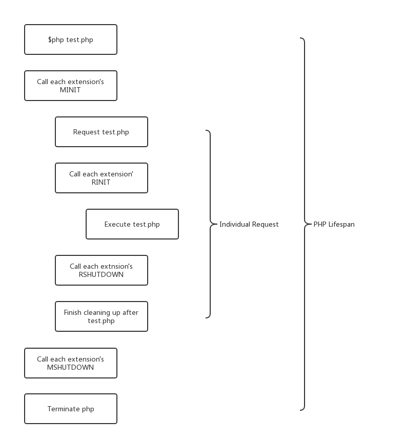
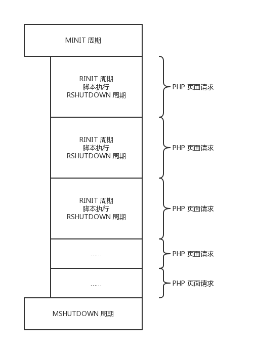

# 生命周期

每个PHP实例，无论是从初始化脚本启动还是命令行启动。都遵循MINIT、RINIT、RSHUTDOWN、MSHUTDOWN以及脚本本身的实际执行这五个部分。觉体每次启动和关闭阶段执行次数与频次取决于所使用的SAPI。最常见的四种SAPI分别是CLI/CGI、多进程模块、多线程模块和嵌入式。

## CLI生命周期

CLI（和CGI） SAPI在其每一次请求的生命周期中都是独一无二的；然而，模块和请求的步骤仍然处在独立的循环中。下图展示了在命令行执行test.php，PHP解释器所发生的一切。

## 多进程生命周期

嵌入到Web服务器中的PHP最常见的配置是使用apache 1的apxs模块（apache的扩展模块）或apache 2的预启动与多处理模块。许多其他Web服务器也属于这一类，我们称之为**多进程模型**。

因为当apache启动的时候，他会立即分出几个子进程，每个进程具有自己的进程空间和彼此独立的函数，所以被称为多进程模型。在任意给定的子进程中，该PHP实例的生命周期很像下图。唯一的不同在于多个请求都属于单个MINIT/MSHUTDOWN之间。

> 只进行一次模块初始化启动，然后每次请求都是请求启动/关闭，达到一定数量或服务器终止时，模块关闭。

## 多线程生命周期

## 嵌入式生命周期

