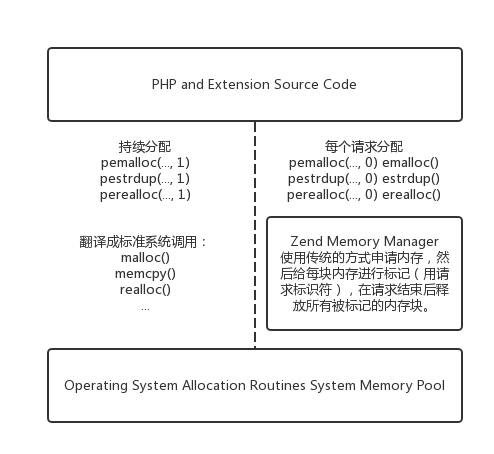

# 内存

在PHP中，填充一个字符串变量就像*<?php $str = 'hello world';?>*一样简单，并且可以自由修改、复制和移动字符串。在C中，另一方面，虽然你可以从一个简单的静态字符串开始，如*char *str = "hello world";*，该字符串不能修改，因为它存在于程序空间中。要创建一个可操作的字符串，你必需分配一块内存并使用诸如*strdup()*之类的函数复制内容。

```c
{
  char *str;
  str = strdup("hello, world");
  if(!str){
    fprintf(stderr, "Unable to allocate memory!");
  }
}
```

由于你将在本章的过程中探讨，传统的内存管理（malloc(),free(),strdup(),realloc(),calloc()等）几乎不会直接有PHP源代码。

## 释放Mallocs

几乎所有平台上的内存管理都以请求和发布方式处理。一个应用程序对它上面的层（通常是操作系统）说”我想要一些数量的内存使用“。如果有可用的空间，操作系统会将其提供给程序，并记下不要将这块内存给任何其他进程。

当应用程序使用内存完成时，预计将其重新提供给操作系统，以便可以在其他地方分配。如果程序没有给会内存，则操作系统无法知道它不再被使用，可以被其他进程重新分配。如果一块内存没有被释放，并且用有的 应用程序已经无影无踪了，那么它会被人为是”泄漏“的，因为它根本没有归属。

在典型的客户端应用程序中，有时可以容忍少量不频繁的泄漏，知道该过程将在短时间内结束，泄漏的内存将隐式返回到操作系统。这不是什么壮举，因为操作系统知道内存是分配给哪个程序的，并且可以确定，程序终止时不再需要内存。

使用长时间运行的服务器守护进程，包括Apache等Web服务器和扩展名mod_php，该进程的运行时间长的多，通常是无限期的。由于操作系统无法清理内存使用情况，任何程度的泄漏都会影响随时间推移的小风险，并最终耗尽所有系统资源。

考虑php中的stristr()函数：为了找到一个使用区分大小写的搜索字符串，它实际上创建了干草堆和针的小写副本，然后执行一个更传统的区分大小写的搜索来查找相对偏移量。然而，在找到字符串的偏移量之后，它不再适用于干草堆和针线的小写版本。如果没有释放这些副本，那么使用stristr()的每个脚本都会在每次调用时泄漏一些内存。最终Web服务器进程将拥有所有系统内存，但无法使用它。

理想的解决方案，我可以听到你大声赞许：代码优质、干净、一致。然而，在像PHP解释器这样的环境中，这只是解决方案的一半。

## 错误处理

为了提供对PHP脚本及其所以来的扩展功能的活动请求的保障，需要存在一中完全跳出活动请求的手段。在Zend引擎中处理的方式是在请求开始时设置一个救助地址，然后 在任何die()或者exit()调用上，或遇到任何严重错误(E_ERROR)执行一个longjmp()到哪个救助地址。

虽然这个救助过程简化了，但它几乎总是意味着资源清理代码（如free()调用）将被跳过，内存可能会泄漏。考虑处理函数调用的引擎代码的简化版本：

```c
void call_function(const char *fname, int fname_len TSRMLS_DC)
{
  zend_function *fe;
  char *lcase_fname;
  /* PHP function names are case-insensitive
   * to simplify locating them in the function tables
   * all function names are implicitly
   * translated to lowercase
   */
  lcase_fname = estrndup(fname, fname_len);
  zend_str_tolower(lcase_fname, fname_len);
  if(zend_hash_find(EG(function_table), lcase_fname, fname_len+1, (void **)&fe) == FAILURE){
    zend_execute(fe->op_array TSRMLS_CC);
  }else{
    php_error_docref(NULL TSRMLS_CC, E_ERROR, "Call to undefined function: %s()", fname);
  }
  efree(lcase_fname);
}
```

当处理到php_error_docref()这一行时，内部错误处理程序会发现错误级别，并调用longjmp()来中断当前的程序流程，并离开call_function()而不会到达efree(lcase_fname)行。这里，你可能认为efree()这一行可以移动到end_error()行之上，但是首先调用call_function()么？最可能的答案是，fname本身是一个分配的字符串，并且在错误消息中使用之前不能释放它。

> **注意**
>
> *php_error_docref()*函数是一个等价于TRigger_error()的内部函数。第一个参数是将附加到docref的可选文档引用。如果在php.ini中启用了root权限。第三个参数可以使任何常见的E_\*系列，表示严重性。第四个和后来的参数遵循printf()样式格式和可变参数列表。

## Zend内存管理器

在请求期间，内存泄漏的解决方案是引擎的Zend内存管理(ZendMM)层的操作方式与操作系统正常运行的方式大致相同，将内存分配给调用应用程序。不同的是，它在处理空间足够低以便被请求感知，以便当该一个请求中断时，它可以执行操作系统在进程死机时拥有的相同动作。也就是说，它隐式释放了该请求拥有的所有内存。图3.1显示了与操作系统和PHP进程相关的ZendMM。



除了提供隐式内存清理之外，ZendMM还可以根据php.ini设置——memory_limit来控制每个请求的内存使用。如果一个脚本尝试要求整个系统可用的内存或者超过每个请求限制的内存，ZendMM将自动哦你发出一个E_ERROR消息并开始缓存过程。另外一个好处是大多数内存调用的返回值不需要检查，因为失败会导致引擎关闭直接执行longjmp()。

在PHP内部代码和操作系统的实际内存管理层之间挂起自己的内容完全不需要使用另外一组功能来请求内部分配的所有内存。例如，使用malloc(16)而不是分配十六字节的内存块，PHP代码将使用emalloc(16)。除了执行实际的内存分配任务外，ZendMM还会将该块标记为关于它所绑定的请求的信息，以便当请求缓冲时，ZendMM可以隐式释放它。

通常，内存需要分配长于单个请求的持续时间。可以使用传统的内存分配器执行这些类型的分配，称为持久分配，因为他们吃虚到请求结束之后，因为这些分配不会添加ZendMM使用的附加的每个请求信息。

然而有时候，知道运行时才知道特定的分配是否需要持久化，所以ZendMM会导出一组辅助宏，其作用与其他内存分配函数一样，但是最后哈有一个额外的参数来指示持久性。

如果你真的想要一个永久分配，这个参数应该设置为1,在这种情况下，请求将被传递给传统malloc()系列的分配器。如果运行时逻辑确定该块不需要持久化，则该参数可以设置为0,并且改掉用将被引导到每个请求的内存分配器功能。例如，pemalloc(buffer_len, 1)映射到malloc(buffer_len)，而pemalloc(buffer_len, 0)映射到emalloc(buffer_len)，使用#define如下（ Zend/zend_alloc.h）：

```c
#define pemalloc(size, persistent) \
	((persistent)?malloc(size):emalloc(size))
```

在ZendMM中找到的每个分配器功能都可以在下面找到，它们是比较传统的应对方式。表3.1显示了ZendMM及其e/pe对应支持的每个分配器功能：

| 分配器方法                                   | e/pe对应                                   |
| --------------------------------------- | ---------------------------------------- |
| void *malloc(size_t count);             | void *emalloc(size_t count);<br />void *pemalloc(size_t count, char persistent); |
| void *calloc(size_t count);             | void *ecalloc(size_t count);<br />void *pecalloc(size_t count, char persistent); |
| void *realloc(void *ptr, size_t count); | void *erealloc(void *ptr, size_t count);<br />void *perealloc(void *ptr, size_t count, char persistent); |
| void *strdup(void *ptr);                | void *estrdup(void *ptr);<br />void *pestrdup(void *ptr, char persistent); |
| void free(void *ptr);                   | void efree(void *ptr);<br />void pefree(void *ptr, char persistent); |

你会注意到，pefree()需要持久性标志。这是一网内在调用pefree()时，实际并不知道ptr是否是持久性分配。在非持久性分配上调用free()可能会导致一个凌乱的双倍空闲，而持久的调用efree()很可能导致分段错误，因为内存管理器尝试查找不存在的管理信息。你的代码预计会记住其分配的数据结构是否持久。

除了核心的分配器功能之外，还有一些额外的和相当方便的ZendMM具体功能：

```c
void *estrndup(void *ptr, int len);
```

分配len+1个字节的内容，并将len个字节从ptr复制到新分配的块。estrndup()的行为大致如下：

```c
void *estrndup(void *ptr, int len)
{
  char *dst = emalloc(len+1);
  memcpy(dst, ptr, len);
  dst[len] = 0;
  return dst;
}
```

隐式放置在缓冲区末尾的终止NULL字节可以确保使用estrndup()进行字符串复制的任何函数不需要担心将生成的缓冲区传递给期望NULL终止字符串（如printf()）的函数。当使用estrndup()来复制非字符串数据时，这个最后一个字节基本上是浪费的，但是通常情况下，方便性远远小于次要的低效率。

```c
void *safe_emalloc(size_t size, size_t count, size_t addtl);
void *safe_pemalloc(size_t size, size_t count, size_t addtl, char persistent);
```

这些函数分配的内存量是((size *count) + addtl)的结果。你可能会问：“为什么要使用额外的函数？为什么不使用emalloc/pemalloc并自己做数学呢？”原因就在于——安全。虽然导致这种情况极难发生，但这种方程的最终结果可能会溢出主机平台的整数限制。这可能会导致负数字节的分配，或者更糟糕的是，正数比调用程序要小得多。safe_emalloc()通过检查整数溢出来避免这种类型的陷阱，并且如果发生这样的溢出则显示失败。

> **注意**
>
> 不是所有的内存分配例程都有一个p*对应。例如，没有pestrndup()，safe_pemalloc（）在PHP5.1之前不存在。偶尔你需要解决ZendAPI中的这些缺失。