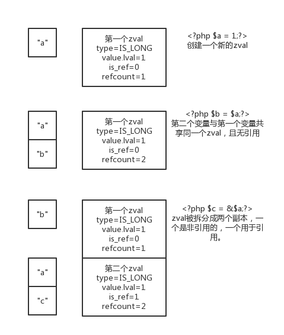
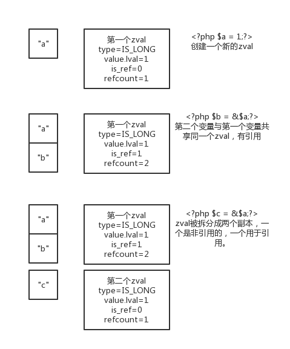

# 引用计数

细节的内存分配和释放对于像PHP这样的多重请求过程的长期性能是至关重要的，但这并不是全部。为了使每秒处理数千次请求的服务器能够高效运行，每个请求都需要使用尽可能烧得内存，并尽可能少地执行不必要的数据复制。考虑下免得PHP代码片段：

```php
<?php
	$a = 'Hello World';
	$b = $a;
	unset($a);
```

在第一次调用之后，一个变量被创建，并且一个12字节的内存块被分配给持有字符串“Hello World”以及尾部的NULL。现在看下面两行：\$b被设置为与\$a相同的值，然后 $a被取消设置(释放)。

如果PHP将每个变量赋值都视为复制变量内容的原因，则需要为复制的字符串复制额外的12个字节，并在数据复制过程中消耗额外的处理器负载。当第三行出现时，这个动作开始显得很荒谬，原来的变量么有设置，使得数据的重复是完全不必要的。现在进一步考虑一下 ，当一个10M文件的内容加载到两个变量中会发生什么情况。这可能需要20M的空间，而实际上10M已经足够了，引擎无需浪费额外的时间和空间来存储两份同样的文件。

你要知道，PHP可是很聪明的。

请记住，变量名和它们的值实际上是引擎内的两个不同的概念。该值本身是一个无名的zval \*，在这种情况下是一个字符串值。它备份配给使用zend_hash_add()的变量$a。如果两个变量名称可以指向相同的值呢？

```c
{
  zval *helloval;
  MAKE_STD_ZVAL(helloval);
  ZVAL_STRING(helloval, "Hello World", 1);
  zend_hash_add(EG(active_symbol_table), "a", sizeof("a"), &helloval, sizeof(zval *), NULL);
  zend_hash_add(EG(active_symbol_table), "b", sizeof("b"), &helloval, sizeof(zval *), NULL);
}
```

在这一点上，你可以实际检查\$a或\$b，看看它们是否都包含字符串“Hello World”。不幸的是，接下来进行的unset($a)。在这种情况下，unset()不知道\$a变量指向的数据也被另一个变量使用，所以它只是盲目地释放内存。任何后续对\$b的访问都将查看一时方的内存空间并导致引擎崩溃，而你不想让这一切发生。

而zval中refcount的存在就是用来解决这个问题的。当一个变量第一次被创建和设置时，它的refcount被初始化为1，因为它被认为只被正在创建的变量所使用。当你的代码片段将helloval分配给$b时，它需要将该refcount增加到2，因为该值现在被两个变量“引用”：

```c
{
  zval *helloval;
  MAKE_STD_ZVAL(helloval);
  ZVAL_STRING(helloval, "Hello World", 1);
  zend_hash_add(EG(active_symbol_table), "a", sizeof("a"), &helloval, sizeof(zval *), NULL);
  ZVAL_ADDREF(helloval);
  zend_hash_add(EG(active_symbol_table), "b" sizeof("b"), &helloval, sizeof(zval*), NULL);
}
```

现在，当unset()删除变量$a的拷贝时，它可以从refcount参数中看到其他人对这个数据感兴趣，实际上它应该减少refcount,否则就把它放在一边。

## 写时拷贝

通过引用计数保存在内存中是一个好主意，但是当你只想要改变期中一个变量时会发生什么？

```php
<?php
	$a = 1;
	$b = $a;
	$b += 5;
```

看代码逻辑，当然你会希望\$a仍等于1,而\$b的结果是6。在这一点上，你也知道Zend正在尽最大努力通过\$a和\$b引用在第二行之后也是一样的zval，所以当第三含到达并且\$b必需被改变时会发生什么呢？

答案是，Zend看着引用计数，看到它大于1,就把它分开。Zend引擎中的分离是销毁参考队的过程，浴缸刚看到的过程相反。

```c
{
  zval **varval, *varcopy;
  if(zend_hash_find(EG(active_symbol_table), varname, varname_len+1, (void**)&varval)==FAILURE){
    /* Variable doesn't actually exist fail out */
    return NULL;
  }
  if((*varval)->refcount<2){
    /*
     * varname is the only actual reference,
     * no separating to do
     */
    return *varval;
  }
  /* Otherwise, make a copy of the zval* value */
  MAKE_STD_ZVAL(varcopy);
  varcopy = *varval;
  /* Duplicate  any allocated structures within the zval* */
  zval_copy_ctor(varcopy);
  
  /*
   * Remove the old version of varname
   * This will decrease the refcount of varval in the process
   */
  zend_hash_del(EG(active_symbol_table), varname, varname_len+1);
  
  /*
   * Initialize the reference count of the newly created value and attach it to the varname variable
   */
  varcopy->refcount = 1;
  varcopy->is_ref = 0;
  zend_hash_add(EG(active_symbol_table), varname, varname_len+1, &varcopy, sizeof(zval*), NULL);
  /* Return the new zval* */
  return varcopy;
}
```

现在引擎有一个zval \*，它知道他拥有$b变量，它可以将它转换为long，并根据脚本请求将其增加5。

## 写时变更

引用计数的概念也为用户空间脚本实际上在“引用”方面所想到的形式创建了数据 操作的新可能性。

```php
<?php
	$a = 1;
	$b = &$a;
	$b += 5;
```

经验丰富的PHP代码的方式，你会直觉地认识到\$a的价值现在将是6,即使它被初始化为1,也不是直接改变。发生这种情况的原因是，当引擎将\$b的值递增5时，它注意到\$b是对\$a的引用，并且说：“对于我而言，更改值而不分离它是可以的，因为我想要所有的引用变量看到变化。”

但是引擎是如何知道的？简单来说，zval中的is_ref。这只是一个简单的开关值。它定义了该值是否实际上是PHP中变量引用的一部分。在前面的代码片段中，执行第一行时，为\$a创建的值为refcount为1，is_ref为0，因为它只是一个变量(\$a)，并且没有其他变量对他的写入引用有变化。在第二行，这个值的refcount元素像以前一样增加到2,除了这次，因为脚本包含一个*&*来表示引用，is_ref被设置为1。

最后，在第三行，引擎再次获取与\$b相关的值，并检查是否需要分离。这次由于之前没有包含一个分支，所以这个值不会分开。这里是*get_var_and_separate()*的refcount监察部分，同时还有一个额外的条件：

```c
if((*varval)->is_ref || (*varval)->refcount<2){
  /*
   * varname is the only actual reference,
   * or it's a full reference to other variables
   * either way: no separating to be done
   */
  return *varval;
}
```

这次，即使refcount为2，由于改值是完整的引用，所以分离过程是短路的。引擎可以自由修改它，而不用担心其他变量的值会自动改变。

## 分离焦虑

所有这些复制和引用，有一些事件的组合，不能通过聪明的操作is_ref和refcount来处理。考虑这个PHP代码块:

```php
<?php
	$a = 1;
	$b = $a;
	$c = &$a;
```

在这里，你需要将一个值与三个不同的变量相关联，其中两个位于写时变更的完整引用对，另一个位于可分李的写时拷贝。使用is_ref和refcount来描述这种关系，什么值将工作？

答案是没有！在这种情况下，该值必须复制到两个离散的zval\* s中，即使两者都包含完全相同的数据（见图3.2）。



同样，3.3中的代码块将导致相同的冲突，并强制该值分成一个副本。



```php
<?php
	$a = 1;
	$b = &$a;
	$c = $a;
```

这里需要注意的是，在这两种情况下，\$b与原始的zval对象相关联，因为在分离发生的时候，引擎不知道操作涉及的第三个变量的名字。